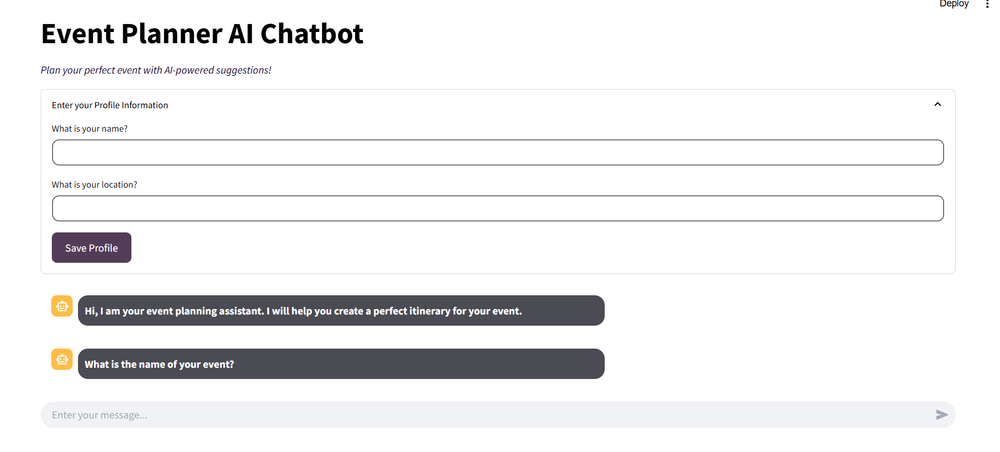
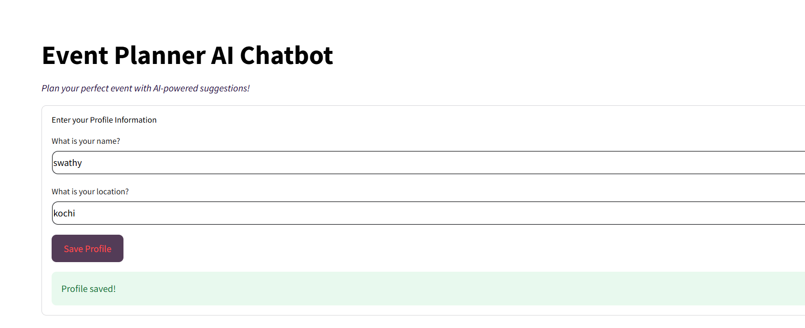
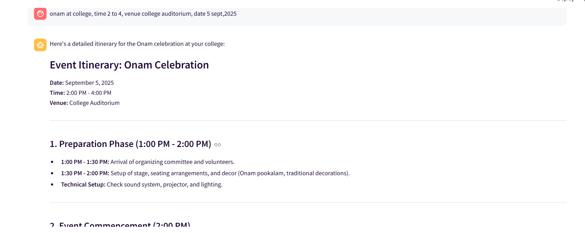
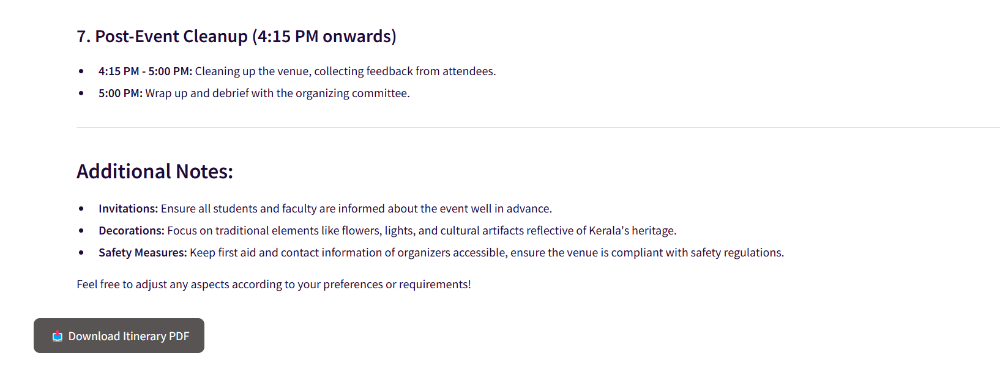
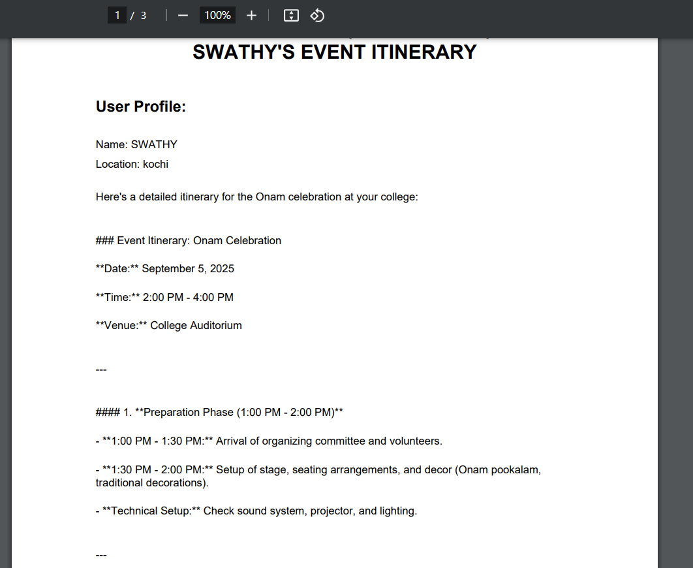

# Happen 🎯

## Basic Details
### Team Name: Sudoku

### Team Members
- Member 1: Shenza K P - CUSAT
- Member 2: Swathy M - CUSAT
- Member 3: Parvathy Santhosh - CUSAT

### Hosted Project Link
[mention your project hosted project link here]

### Project Description
Our chatbot is designed to assist users in planning their events with ease. It generates customized itineraries based on user input and integrates with user profiles to suggest the best event planning options.

### The Problem statement
Planning an event can be a headache—figuring out the schedule, managing catering options, and handling every little detail can be overwhelming. Our chatbot takes the stress out of planning!

### The Solution
We’ve built an AI-powered event planning chatbot that helps users plan their events by generating itineraries, offering suggestions, and providing instant feedback, all while learning the user’s preferences.

## Technical Details
### Technologies/Components Used
For Software:
For Software:

Languages used: Python
- Frameworks used: Streamlit, OpenAI API
- Libraries used: reportlab (for generating PDFs), - - python-dotenv (for environment variables)
- Tools used: Firebase (for authentication), OpenAI - API (for generating itineraries)

### Implementation

# Installation
For Software: pip install streamlit python-dotenv openai reportlab pillow

# Run
streamlit run app.py

### Project Documentation
For Software:

# Screenshots (Add at least 3)

*Add caption explaining what this shows*

*Add caption explaining what this shows*

*Add caption explaining what this shows*

# Diagrams

*Add caption explaining your workflow*

For Hardware:

# Schematic & Circuit

*Add caption explaining connections*

*Add caption explaining the schematic*

# Build Photos

*List out all components shown*

*Explain the build steps*

*Explain the final build*

### Project Demo
# Video
[Add your demo video link here]
*Explain what the video demonstrates*

# Additional Demos
[Add any extra demo materials/links]

## Team Contributions
- [Name 1]: [Specific contributions]
- [Name 2]: [Specific contributions]
- [Name 3]: [Specific contributions]

---
Made with ❤️ at TinkerHub
